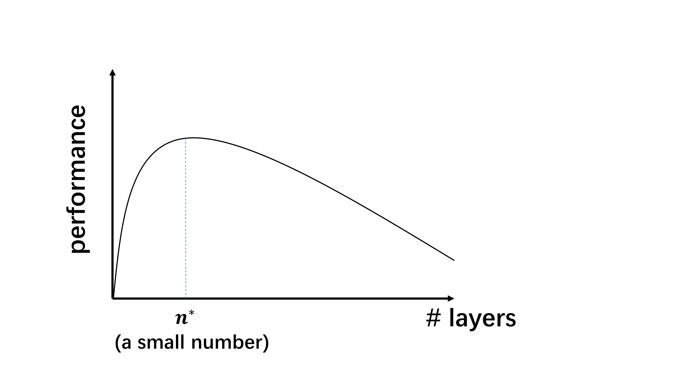
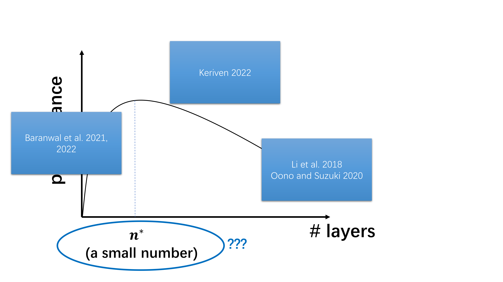
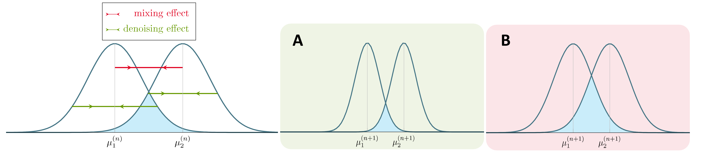
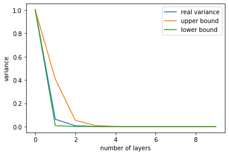
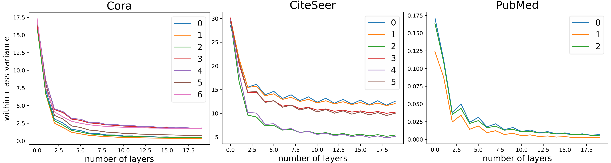
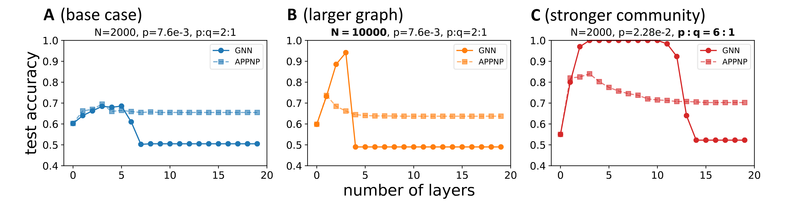

Oversmoothing is a well-known problem in message-passing GNNs. But how come it happens when a GNN only has 2-4 layers? In this post, I am going to discuss our ICLR'23 paper "[A Non-Asymptotic Analysis of Oversmoothing in Graph Neural Networks](https://arxiv.org/abs/2212.10701)", which provides the first quantitative finite-depth theory of oversmoothing in GNNs and explains why oversmoothing would occur at a shallow depth.

Introduction
======

Most GNNs follow the message-passing paradigm, where  node representations are computed by recursively aggregating and transforming the representations of the neighboring nodes. One notably drawback of this repeated message-passing is **oversmoothing**, which refers to the phenomenon that increasing model depth leads to homogeneous node representations and thus worse downstream task performances. As a result, many GNNs used in practice remain shallow and often only have a few layers. For example, popular baseline architectures like GCN and GAT all only have 2-4 layers.

Typical GNN performances with respect to the model depth would look like the following plot, where increasing network depth will first increase the performance, and once the model bypasses its optimal depth, which is typically a small number (e.g. 2-4 layers), the performance will quickly decrease.

Oversmoothing was something researchers noticed even back to the earliest days of GNNs, when Kipf and Welling introduced GCN. So what has been understood about this performance plot in the past? 

- As the number of layers tends to infinity, oversmoothing is inevitable [Li et al. 2018, Oono and Suzuki 2020]. 
- Having "some" graph convolutions is better than having no graph convolutions [Baranwal et al. 2021, 2022].
- Combining the above two points of views, the optimal depth is finite (i.e. the curve should indeed have a hump shape) [Keriven 2022].

What hasn't been understood about oversmoothing?
------

It seems that we have understood everything about this plot. So what hasn't been understood about oversmoothing? 
Let me emphasize the following point: the occurrence of oversmoothing itself in the asymptotic regime is not sufficient to make it an important empirical problem. For example, if one trains a CNN(ResNet) for image classification with increasing depth, the performance curve would have a similar shape as the one for GNNs in the above plot, except now the peak is at, say 100 layers. In that case, oversmoothing is no longer a problem. **It is the fast onset of oversmoothing makes it an important problem in practice for developing more powerful GNNs and there has not been a statisfactory explanation about it.**

As such, the main goal of our work is to answer the following two questions: 

- Why does oversmoothing happen at a relatively shallow depth?
- Can we quantitatively model the effect of applying a finite number of graph convolutions and
theoretically predict the “sweet spot” for the choice of depth?

Two counteracting effects (one desirable and one undesirable) of message-passing
======
Message-passing homogenizes node represetnations. However, we should distinguish between two kinds of homogenization:
- **Denoising:** nodes within the same class become similar. This will make the classification task easier.
- **Mixing:** nodes among different classes become similar. This will make the classification task more difficult.

Analysis set-up
------
In our analysis, we formulize the above two effects by analyzing the effects of a finite number of graph convolutions on a random graph model called the Contextual Stochastic Block Model (CSBM) [Deshpande et al. 2018]. The reason that we choose the CSBM to conduct the analysis is three-folds:
- It mimics the community structure of real graphs.
- It enables us to evaluate the model performance with clear ground truth class labels.
- Most importantly, as a generative mdoel, the CSBM gives us full control over the graph structure and allows us to analyze the effect of a finite number of graph convolutions.

In the CSBM, the graph structure is formed according to the standard SBM, i.e. nodes are divided into blocks. For a pair of nodes within the same block, there is an edge formed independently with probability $p$, and for a pair of nodes belonging to different blocks, the probability is $q$. The name "contextual" comes from the fact that in addition to the graph structure, the model also generates node features $X$. For nodes within the same block, their features are drawn indepedently from the same Gaussian distribution and different blocks draw the features from their own Gaussian distributions. We consider the case where we have two equal-sized blocks, each with $N/2$ nodes, and the initial Gaussian distributions for node features are $\mathcal{N}(\mu_i, \sigma^2), i =1,2$.

Our theoretical analysis focuses on the simplified linear GNN model defined as follows: a graph convolution using the (left-)normalized adjacency matrix takes the operation $$h' = (D^{-1}A)h,$$ where $h$ and $h'$ are the input and output node representations, respectively.  A linear GNN layer can then be defined as $$h' = (D^{-1}A) h W,$$ where $W$ is a learnable weight matrix.
As a result, the output of $n$ linear GNN layers can be written as $$h^{(n)}\prod_{k=1}^n W^{(k)},$$ where $h^{(n)}=(D^{-1}A)^n X$ is the output of $n$ graph convolutions, and $W^{(k)}$ is the weight matrix of the $k^{\text{th}}$ layer. Since this is linear in $h^{(n)}$, it follows that $n$-layer linear GNNs have the equivalent representation power as linear classifiers applied to $h^{(n)}$. Thus, we are interested in the distribution of $h^{(n)}$. Thanks to the linearity of the model, we see that the representation of node $v$ in block $i=1,2$ after $n$ graph convolutions is distributed as $\mathcal{N}(\mu_i^{(n)},(\sigma^{(n)})^2)$, where the variance $(\sigma^{(n)})^2$ is shared between classes. 

Intuition
------
Before presenting our results, let's first get some intuition about what  is happening when we apply graph convolutions. Since graph convolutions make nodes both across different classes and within the same class similar, schematically, that is to say, the means of the two Gaussian distributions will get closer (mixing), but the variance of each Gaussian will also shrink (denoising). The blue overlapping area represents two times the Bayes optimal error, that is, if one uses $h^{(n)}$ for classification, what is the lowest error he/she can get under the optimal classifier. 
 
The Bayes error in fact has a closed formula $1-\Phi(\frac{\mu_2^{(n)}-\mu_1^{(n)}}{\sigma^{(n)}})$, where $\Phi$ is the CDF function of the standard Gaussian. The higher the ratio $\frac{\mu_2^{(n)}-\mu_1^{(n)}}{\sigma^{(n)}}$, the lower the Bayes error and we expect better classification performance. We use $\mu_2^{(n)}-\mu_1^{(n)}$ (distance between the two means) to quantify the means collasping mixing effect, and $(\sigma^{(n)})^2$ (variance within the same class) to quantify the variance shrinking denoising effect.

Means always move together when you stack more graph convolutions
------
Our results (Theorem 1) shows that, approximately,

$$\mu_2^{(n)}-\mu_1^{(n)} \approx \left(\frac{p-q}{p+q}\right)^n(\mu_2-\mu_1),$$

which means that when one adds graph convolutions, means always move together exponentially fast. This coincides with the intuition people have deveoped in the asymptotic analysis.

In simulation, it is easy to verify the above approximation that means get closer exponentially fast:

Variance does not go down indefinitely when you stack more graph convolutions 
------
One misleading intuition some people have about GNNs, is that since stacking more graph convolutions gives information about larger neighborhoods of the graph, it should always give you a "better" result.  However, this is not true in practice. There is in fact, a nontrivial, absolute lower bound associated with the variace (Lemma 2).

$$\text{For all } n\geq 0,\frac{1}{N}\sigma^2 \leq (\sigma^{(n)})^2 \leq \sigma^2\,.$$

The intepretation of the above result is, since there is only a finite number of nodes in the graph, there is only finite amount of information in the graph. One certainly cannot go beyond the total amount of information, no matter how much message-passing one does. 

In our paper, we offer more refined bounds for each $(\sigma^{(n)})^2$, which suggests that the variance $(\sigma^{(n)})^2$ will initially go down at least at a rate exponential in $O(1/\log N)$ before it saturates at the fixed lower bound $\sigma^2/N$. This means that after $O(\log N/\log(\log N))$ layers, the desirable denoising effect homogenizing node representations in the same class will saturate and the undesirable mixing effect will start to dominate. 

In simulation, it is clear to see this saturation effect in variance. Using the more refined bounds developed in our paper, we can upper and lower bound the variance pretty well on synthetic graphs generated from the CSBM.

The same saturation effect can also be observed on real graphs. Here the labels indicate different communities.

Why does oversmoothing happen at a shallow depth?
------
Putting everything together, we can see why does oversmoothing happen at a shallow depth in GNNs:

-  Message-passing with different-class nodes homogenizes their representations exponentially. The exponential rate is $\frac{p-q}{p+q}$.
- Message-passing with nodes that have not been encountered before causes the denoising effect, and the magnitude depends on the absolute number of newly encountered neighbors. 
- The diameter of the graph is at most $\log N/\log(\log N)$ in our case.
- After the number of layers surpasses the diameter, for each node, there will be no nodes that have not been encountered before in message-passing and hence the denoising effect will almost vanish. This is why even in a large graph, the mixing effect will quickly dominate the denoising effect when we increase the number of layers, and so oversmoothing is expected to happen at a shallow depth.

Do popular proposed solutions to oversmoothing really work?
======

TL;DR: Not really. The problem of many solutions is that they are based on the understanding of oversmoothing in the asymptotic regime, which only focuses on the mixing effect and becomes incomplete in the non-asymptotic case as we have seen. Therefore, with the new insights we develop, these methods can actually be proven to be worse than vanilla GNNs on certain graphs. 

Specifically, in our paper, we extend the analysis to APPNP/GCNII, which are equivalent but has different motivations: APPNP uses the (approximate) Personalized PageRank propagation to replace the original graph convolution [Klicpera et al. 2019], while GCNII adds a residual connection to the initial node representations $X$ from each subsequent layer [Chen et al. 2020]. Mathematically, their layer-wise update rule an be written as 

$$h^{\text{APPNP}(n+1)} = (1-\alpha)(D^{-1}A)h^{\text{APPNP}(n)} + \alpha X$$

where the term $\alpha X$ can also be intepreted as a residual connection to the initial representation $X$. The rationale hehind these methods is that "the teleportation probability $\alpha$ (or connection to the initial representation) allows us to balance the needs of preserving locality (i.e. staying close to the root node to avoid oversmoothing) and leveraging the information from
a large neighborhood" (Klicpera et al. 2019).

What is going wrong?
------
So the natural question is, is Personalized PageRank/residual connection the cure for oversmoothing? The answer is **maybe**, depending on what you want. Remember, **a deeper model is not necessarily a better model!**

Our results suggest that, when the number of layers $n$ is large, where the mixing effect is dominant, these methods can do better than the vanilla graph convolution approach by reducing the mixing effect. Yet our results also show that for certain CSBM graphs, these methods will do worse in terms of the optimal classification performance.

**The main problem of these methods is that the original intuition behind them only focuses on the mixing effect and thus it is incomplete.** At each step of message passing, allowing $\alpha$ portion message coming from the root node indeed prevents means from collapsing too fast (what the original intuition was), but it also slows down variance shrinking (our complete intuition, as meeting new nodes in message-passing is the source for reducing the variance). The interplay of the two effects is graph-dependent---when graphs are large or have strong community structure, the reduction of the beneficial denoising effect would be greater than the catastrophic mixing effect and these methods can perform worse than vanilla graph convolution. 

We verified the above claim in numerical experiments, where we compare APPNP to the vanilla graph convolution approach on the CSBM with different hyperparameters. In all cases, APPNP manifests its advantage of reducing the mixing effect compared to GNN when the number of layers is large, i.e. when the undesirable mixing effect is dominant. However, as B,C show, when we have large graphs or graphs with strong community structure, APPNP's disadvantage of concurrently reducing the denoising effect is more severe, particularly when the number of layers is small. As a result, APPNP's optimal performance is worse than the baseline GNN.

Similar reasoning and analysis can be also applied to other methods such as normalization. For example, PairNorm [Zhao and Akoglu 2020] makes the node representations to maintain certain distances by rescaling them after each round of message-passing. Although such method is able to combat the mixing effect by maintaining certain distances between the means of different classes, it will ruin the beneficial denoising effect of graph convolutions by blowing up the witin-class variance. 

How should one choose between methods?
------

So should one use these proposed solutions in practice? It really depends on what your downstream task is. If your downstream task certainly requires long-range information such as counting the number of 20-hop neighbors, then go with the more-robust-to-depth methods. But if your task is simply node classification, sticking to vanilla GCN might not be a bad idea. 

What else plays a role in oversmoothing?
======
Recall that in the earlier "Analysis set-up" section, we said that from a forward model perspective, a $n$-layer linear GNN $h^{(n)}\Pi_{k=1}^nW^{(0)}$ is equivalent to linear classifiers applied to the output of $n$ graph convolutions $h^{(n)}$. However, these two models are different from a optimization perspective, where the former requires optimizing weights in each GNN layer, and the latter only requires optimizing a linear classifier in the end. 

Comparing the two models trained in practice, we observe that adding learnable weights in each GNN layer does not improve node classification performance but rather leads to optimization difficulty. Increasing width is able to mitigate the problem for shallower models, but it becomes much more difficult to tackle beyond 10 layers to the point that simply increasing the width could not solve it. 

As a result, although GNNs with and without weights in each message-passing layer are on par with each other when both are shallow, the former has much worse performance when the number of layers goes beyond 10. These results suggest that the oversmoothing phenomenon observed in practice (the colored curves are often reported as "oversmoothing" in the literature) is in fact a mixture of pure oversmoothing and the difficulty of optimizing deep GNN models. 

Final thoughts
======
Let me make the final remark. Oversmoothing becomes an important problem in the literature partly because typical Convolutional Neural Networks (CNNs) used for image processing are much deeper than GNNs. As such, some people have been asking this question: why can't GNNs be as deep as their original inspiration, CNNs, and they have been trying to use methods that have previously worked for CNNs to make current GNNs deeper.

But CNNs are used for image processing. **Images and real-world graphs have fundamentally different structural characteristics!** In particular, images are giant grids, meaning that aggregating information between faraway pixels often requires a large number of layers. This contrasts with real-world graphs, which often have small diameters (the "small-world" phenomenon). 

That is to say, Kaiming does not offer us free lunch (and he did not intend to). As someone who has always been fasinated by the beauty and power of graph theory, I believe that building more powerful GNNs will require us to think beyond CNNs and images and take advantage of the structure in real graphs.

Thank you for your attention. Hope this post has helped you understand more about oversmoothing! Questions and comments are welcomed :) 

References
------
Li et al.. Deeper Insights into Graph Convolutional Networks for Semi-Supervised Learning. In AAAI, 2018.

Oono and Suzuki. Graph Neural Networks Exponentially Lose Expressive Power for Node Classification. In ICLR, 2020.

Baranwal et al.. Graph Convolution for Semi-Supervised Classification: Improved Linear Separability and Out-of-Distribution Generalization. In ICML, 2021.

Baranwal et al.. Effects of Graph Convolutions in Deep Networks. ArXiv, abs/2204.09297, 2022.

Deshpande et al.. Contextual Stochastic Block Models. In NeurIPS, 2018.

Klicpera et al.. Predict then Propagate: Graph Neural Networks meet Personalized PageRank. In ICLR, 2019.

Chen et al.. Simple and Deep Graph Convolutional
Networks. In ICML, 2020.

Zhao and Akoglu. PairNorm: Tackling Oversmoothing in GNNs.In ICLR, 2020.

